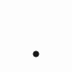

# Verified Motion Icon Showcase

这里展示通过 production verifier 的最终动态图标成品。GitHub 页面使用多帧 `preview.gif` 直接展示动态效果；真正的量产实现仍以对应的 `motion-icon.svg`、production fixture contract 和 `scripts/runtime/svg-waapi-controller.js` 为准。

## Lock / Unlock

[`motion-icon.svg`](showcase/production-lock/motion-icon.svg) · [`contract`](fixtures/production-lock/contract.json)

## Seat Heating 0–3

[`motion-icon.svg`](showcase/production-seat-heating/motion-icon.svg) · [`contract`](fixtures/production-seat-heating/contract.json)

## Wi-Fi 0–3

[`motion-icon.svg`](showcase/production-wifi/motion-icon.svg) · [`contract`](fixtures/production-wifi/contract.json)

## Play / Pause

[`motion-icon.svg`](showcase/production-play-pause/motion-icon.svg) · [`contract`](fixtures/production-play-pause/contract.json)

## 发布规则

- 只有完整 production pipeline 验证通过的成品才允许进入 `showcase/`。
- GitHub 页面使用多帧 GIF 作为稳定可见的 motion preview；README 中的 SVG 动画不作为展示兼容性前提。
- Showcase 预览不能替代 verifier 证据；量产结论仍以 production package 的 `verification.status == PASS` 为准。
- 最终交付必须同时保留：产品 contract、可集成运行时实现、验证证据和可视预览。
- 用户提供的 blind / 私有 SVG 默认不公开；只有明确允许公开或仓库自带的 production fixture 才进入 Showcase。
